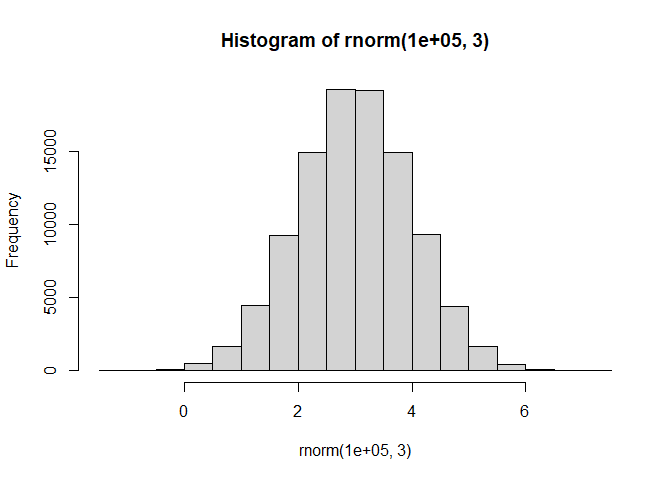
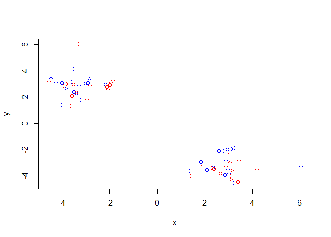
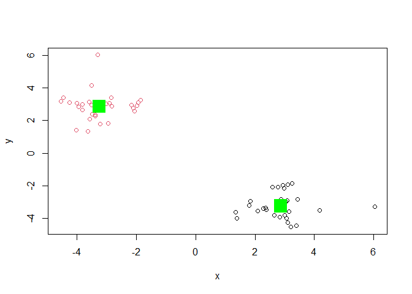
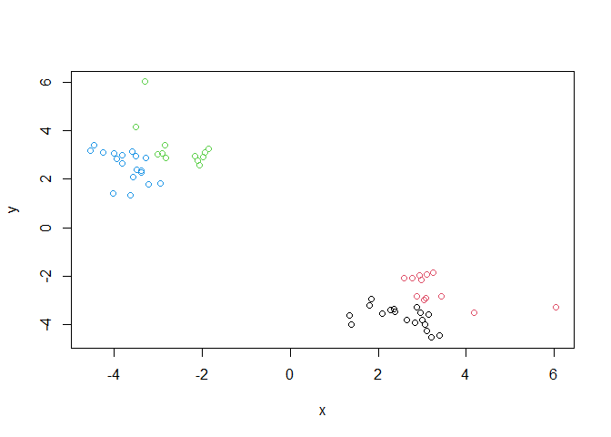
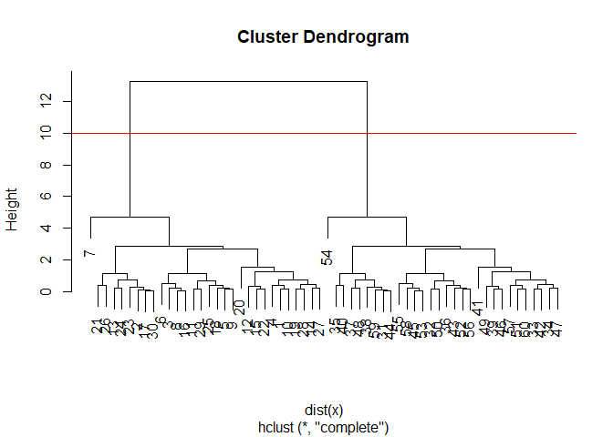
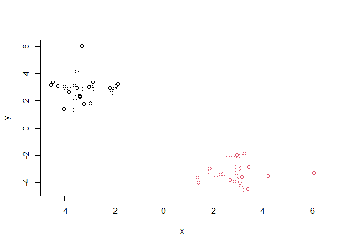
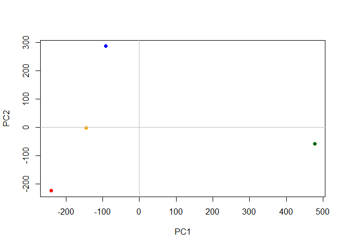

# Class 7: Machine Learning 1
Kevin Tan (PID: A16774162)

Today we will start out multi-part exploration of some key meachine
learning methods. We will being with clustering - findings groupings of
like data, and then dimensionallity reduction

## Clustering

Let’s start with “k-means” clustering The main function in base R for
this is `k-means()`

``` r
# make up some data 
hist(rnorm(100000, 3))
```



``` r
tmp <- c(rnorm(30, -3), rnorm(30, +3))
x <- cbind(x=tmp, y=rev(tmp))
plot(x)
```


Now let’s try out `kmeans()`

``` r
km <- kmeans(x, centers=2)
km
```

    K-means clustering with 2 clusters of sizes 30, 30

    Cluster means:
              x         y
    1  2.864679 -3.252121
    2 -3.252121  2.864679

    Clustering vector:
     [1] 2 2 2 2 2 2 2 2 2 2 2 2 2 2 2 2 2 2 2 2 2 2 2 2 2 2 2 2 2 2 1 1 1 1 1 1 1 1
    [39] 1 1 1 1 1 1 1 1 1 1 1 1 1 1 1 1 1 1 1 1 1 1

    Within cluster sum of squares by cluster:
    [1] 38.05614 38.05614
     (between_SS / total_SS =  93.6 %)

    Available components:

    [1] "cluster"      "centers"      "totss"        "withinss"     "tot.withinss"
    [6] "betweenss"    "size"         "iter"         "ifault"      

``` r
attributes(km)
```

    $names
    [1] "cluster"      "centers"      "totss"        "withinss"     "tot.withinss"
    [6] "betweenss"    "size"         "iter"         "ifault"      

    $class
    [1] "kmeans"

> Q. How many points in each cluster

``` r
km$size
```

    [1] 30 30

> Q. What component of your results object details cluster
> assignment/membership?

``` r
km$cluster
```

     [1] 2 2 2 2 2 2 2 2 2 2 2 2 2 2 2 2 2 2 2 2 2 2 2 2 2 2 2 2 2 2 1 1 1 1 1 1 1 1
    [39] 1 1 1 1 1 1 1 1 1 1 1 1 1 1 1 1 1 1 1 1 1 1

> Q. What are centers/mean values of each cluster

``` r
km$centers
```

              x         y
    1  2.864679 -3.252121
    2 -3.252121  2.864679

> Q. Make a plot of your data showing your clustering results

``` r
plot(x, col=c("red","blue"))
```



``` r
plot(x, col=km$cluster)
points(km$centers, col="green", pch=15, cex=3)
```



> Q. Run`kmeans()` again and cluster into 4 groups and plot the results.

``` r
km_new <- kmeans(x, 4)
plot(x, col=km_new$cluster)
```



## Hierarchical Clustering

This form of clustering aims to reveal the structure in your data by
progressively grouping points into a ever smaller number of clusters

The main function in base R for this is called `hclust()`. This function
does not take our input data directly but wants a “distance matrix” that
details how dis-similar all our input points are to each other.

``` r
hc <- hclust(dist(x))
hc
```


    Call:
    hclust(d = dist(x))

    Cluster method   : complete 
    Distance         : euclidean 
    Number of objects: 60 

The print out above is not very useful (unlick that from kmeans) but
there is a useful `plot()` method.

``` r
plot(hc)
abline(h=10, col="red")
```



To get my main result (my cluster membership vector) I need to “cut” my
tree using the function `cutree()`

``` r
grps <- cutree(hc, h=10)
grps
```

     [1] 1 1 1 1 1 1 1 1 1 1 1 1 1 1 1 1 1 1 1 1 1 1 1 1 1 1 1 1 1 1 2 2 2 2 2 2 2 2
    [39] 2 2 2 2 2 2 2 2 2 2 2 2 2 2 2 2 2 2 2 2 2 2

``` r
plot(x, col=grps)
```



## Principal Component Analysis (PCA)

``` r
url <- "https://tinyurl.com/UK-foods"
x <- read.csv(url)
```

> Q1. How many rows and columns are in the dataset?

``` r
dim(x)
```

    [1] 17  5

``` r
head(x, 6)
```

                   X England Wales Scotland N.Ireland
    1         Cheese     105   103      103        66
    2  Carcass_meat      245   227      242       267
    3    Other_meat      685   803      750       586
    4           Fish     147   160      122        93
    5 Fats_and_oils      193   235      184       209
    6         Sugars     156   175      147       139

``` r
rownames(x) <- x[,1]
x <- x[,-1]
head(x)
```

                   England Wales Scotland N.Ireland
    Cheese             105   103      103        66
    Carcass_meat       245   227      242       267
    Other_meat         685   803      750       586
    Fish               147   160      122        93
    Fats_and_oils      193   235      184       209
    Sugars             156   175      147       139

``` r
dim(x)
```

    [1] 17  4

Faster method to change row names:

``` r
x <- read.csv(url, row.names=1)
head(x)
```

                   England Wales Scotland N.Ireland
    Cheese             105   103      103        66
    Carcass_meat       245   227      242       267
    Other_meat         685   803      750       586
    Fish               147   160      122        93
    Fats_and_oils      193   235      184       209
    Sugars             156   175      147       139

> Q2. Which approch to solving the row-names problem do you prefer

I prefer the second method, since it is much shorter, requiring only 1
line of code. It is also more well-defined, since running the first
version multiple times will keep shifting the row header column

``` r
barplot(as.matrix(x), beside=T, col=rainbow(nrow(x)))
```


> Q3. Changing what optional arguemtn results in a stacked barplot?

Changes besides to False or deleting this argument

``` r
barplot(as.matrix(x), col=rainbow(nrow(x)))
```


The so-called “pairs” plto canbe useful for small datasets

``` r
pairs(x, col=rainbow(10), pch=16)
```


So, the pairs plot is useful for small datasets but it can be lot of
work to interpret and gets intractable for larger datasets.

so PCA to the rescue…

The main function to do PCA in base R is called `prcomp()`. This
function wants thr transpose of our data in this case.

``` r
pca <- prcomp(t(x))
summary(pca)
```

    Importance of components:
                                PC1      PC2      PC3       PC4
    Standard deviation     324.1502 212.7478 73.87622 3.176e-14
    Proportion of Variance   0.6744   0.2905  0.03503 0.000e+00
    Cumulative Proportion    0.6744   0.9650  1.00000 1.000e+00

``` r
attributes(pca)
```

    $names
    [1] "sdev"     "rotation" "center"   "scale"    "x"       

    $class
    [1] "prcomp"

``` r
pca$x
```

                     PC1         PC2        PC3           PC4
    England   -144.99315   -2.532999 105.768945 -4.894696e-14
    Wales     -240.52915 -224.646925 -56.475555  5.700024e-13
    Scotland   -91.86934  286.081786 -44.415495 -7.460785e-13
    N.Ireland  477.39164  -58.901862  -4.877895  2.321303e-13

A major PCA result visualization is called a “PCA Plot” (aka a score
plot, biplot, PC1 vs PC2 plot, ordination plot)

``` r
mycols <- c("orange", "red", "blue", "darkgreen")
plot(pca$x[,1], pca$x[,2], col=mycols, pch=16,
     xlab="PC1", ylab="PC2")
abline(h=0, col="gray")
abline(v=0, col="gray")
```



Another important output from PCA is called the “loadings” vector or the
“rotation” component - this tells us how much the original variables
(the foods in this case) contribute to the new PCs.

``` r
pca$rotation
```

                                 PC1          PC2         PC3          PC4
    Cheese              -0.056955380  0.016012850  0.02394295 -0.694538519
    Carcass_meat         0.047927628  0.013915823  0.06367111  0.489884628
    Other_meat          -0.258916658 -0.015331138 -0.55384854  0.279023718
    Fish                -0.084414983 -0.050754947  0.03906481 -0.008483145
    Fats_and_oils       -0.005193623 -0.095388656 -0.12522257  0.076097502
    Sugars              -0.037620983 -0.043021699 -0.03605745  0.034101334
    Fresh_potatoes       0.401402060 -0.715017078 -0.20668248 -0.090972715
    Fresh_Veg           -0.151849942 -0.144900268  0.21382237 -0.039901917
    Other_Veg           -0.243593729 -0.225450923 -0.05332841  0.016719075
    Processed_potatoes  -0.026886233  0.042850761 -0.07364902  0.030125166
    Processed_Veg       -0.036488269 -0.045451802  0.05289191 -0.013969507
    Fresh_fruit         -0.632640898 -0.177740743  0.40012865  0.184072217
    Cereals             -0.047702858 -0.212599678 -0.35884921  0.191926714
    Beverages           -0.026187756 -0.030560542 -0.04135860  0.004831876
    Soft_drinks          0.232244140  0.555124311 -0.16942648  0.103508492
    Alcoholic_drinks    -0.463968168  0.113536523 -0.49858320 -0.316290619
    Confectionery       -0.029650201  0.005949921 -0.05232164  0.001847469

PCA looks to be a super useful method for gaining some insight into
high-dimensional data that is difficult to examine in other ways.

## PCA RNA-seq Data

Data Input

``` r
url2 <- "https://tinyurl.com/expression-CSV"
rna.data <- read.csv(url2, row.names=1)
head(rna.data)
```

           wt1 wt2  wt3  wt4 wt5 ko1 ko2 ko3 ko4 ko5
    gene1  439 458  408  429 420  90  88  86  90  93
    gene2  219 200  204  210 187 427 423 434 433 426
    gene3 1006 989 1030 1017 973 252 237 238 226 210
    gene4  783 792  829  856 760 849 856 835 885 894
    gene5  181 249  204  244 225 277 305 272 270 279
    gene6  460 502  491  491 493 612 594 577 618 638

``` r
pca <- prcomp(t(rna.data), scale=TRUE)
 
plot(pca$x[,1], pca$x[,2], xlab="PC1", ylab="PC2")
```


``` r
summary(pca)
```

    Importance of components:
                              PC1    PC2     PC3     PC4     PC5     PC6     PC7
    Standard deviation     9.6237 1.5198 1.05787 1.05203 0.88062 0.82545 0.80111
    Proportion of Variance 0.9262 0.0231 0.01119 0.01107 0.00775 0.00681 0.00642
    Cumulative Proportion  0.9262 0.9493 0.96045 0.97152 0.97928 0.98609 0.99251
                               PC8     PC9      PC10
    Standard deviation     0.62065 0.60342 3.457e-15
    Proportion of Variance 0.00385 0.00364 0.000e+00
    Cumulative Proportion  0.99636 1.00000 1.000e+00

> Q. How many genes in this dataset?

``` r
nrow(rna.data)
```

    [1] 100

``` r
attributes(pca)
```

    $names
    [1] "sdev"     "rotation" "center"   "scale"    "x"       

    $class
    [1] "prcomp"

``` r
head(pca$x)
```

              PC1        PC2        PC3        PC4        PC5        PC6
    wt1 -9.697374  1.5233313 -0.2753567  0.7322391 -0.6749398  1.1823860
    wt2 -9.138950  0.3748504  1.0867958 -1.9461655  0.7571209 -0.4369228
    wt3 -9.054263 -0.9855163  0.4152966  1.4166028  0.5835918  0.6937236
    wt4 -8.731483 -0.7468371  0.5875748  0.2268129 -1.5404775 -1.2723618
    wt5 -9.006312 -0.2945307 -1.8498101 -0.4303812  0.8666124 -0.2496025
    ko1  8.846999  2.2345475 -0.1462750 -1.1544333 -0.6947862  0.7128021
                PC7         PC8         PC9         PC10
    wt1 -0.24446614  1.03519396  0.07010231 3.073930e-15
    wt2 -0.03275370  0.26622249  0.72780448 1.963707e-15
    wt3 -0.03578383 -1.05851494  0.52979799 2.893519e-15
    wt4 -0.52795595 -0.20995085 -0.50325679 2.872702e-15
    wt5  0.83227047 -0.05891489 -0.81258430 1.693090e-15
    ko1 -0.07864392 -0.94652648 -0.24613776 4.052314e-15

``` r
kmeans(pca$x[,1], centers = 2 )
```

    K-means clustering with 2 clusters of sizes 5, 5

    Cluster means:
           [,1]
    1 -9.125676
    2  9.125676

    Clustering vector:
    wt1 wt2 wt3 wt4 wt5 ko1 ko2 ko3 ko4 ko5 
      1   1   1   1   1   2   2   2   2   2 

    Within cluster sum of squares by cluster:
    [1] 0.5017505 0.2648467
     (between_SS / total_SS =  99.9 %)

    Available components:

    [1] "cluster"      "centers"      "totss"        "withinss"     "tot.withinss"
    [6] "betweenss"    "size"         "iter"         "ifault"      

I will make a main result figure using ggplot:

``` r
library(ggplot2)
```

``` r
res <- as.data.frame(pca$x)
```

``` r
ggplot(res) +
  aes(x= PC1, y=PC2) + 
  geom_point()
```


``` r
kmeans(pca$x[,1], centers =2)
```

    K-means clustering with 2 clusters of sizes 5, 5

    Cluster means:
           [,1]
    1  9.125676
    2 -9.125676

    Clustering vector:
    wt1 wt2 wt3 wt4 wt5 ko1 ko2 ko3 ko4 ko5 
      2   2   2   2   2   1   1   1   1   1 

    Within cluster sum of squares by cluster:
    [1] 0.2648467 0.5017505
     (between_SS / total_SS =  99.9 %)

    Available components:

    [1] "cluster"      "centers"      "totss"        "withinss"     "tot.withinss"
    [6] "betweenss"    "size"         "iter"         "ifault"      
