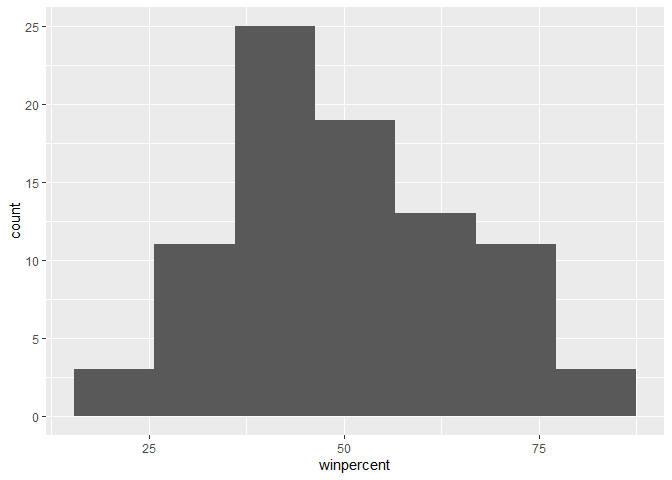
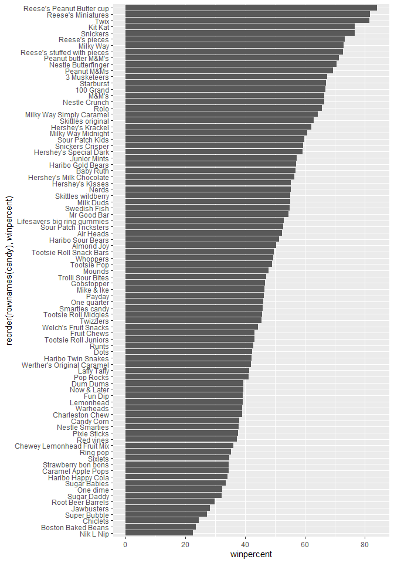
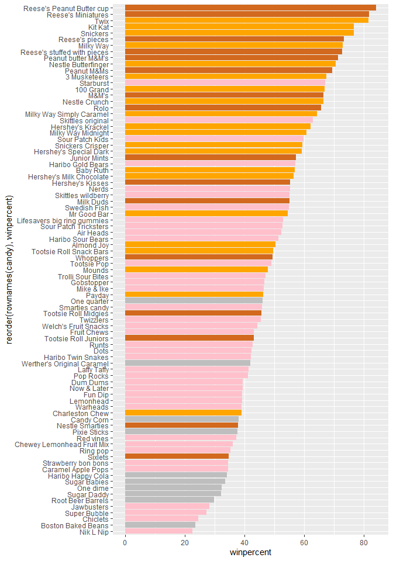
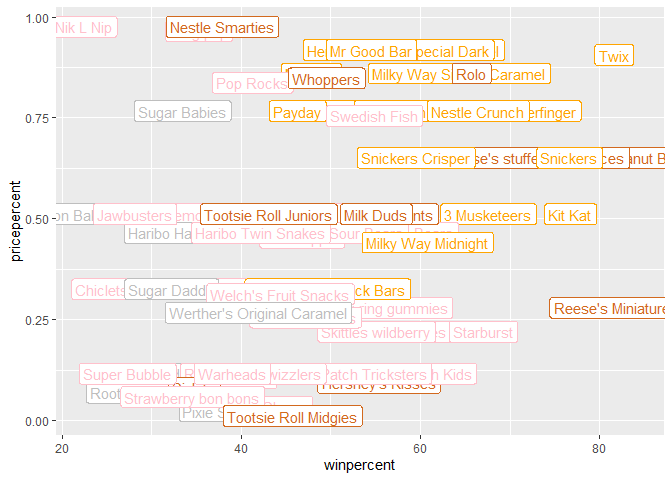
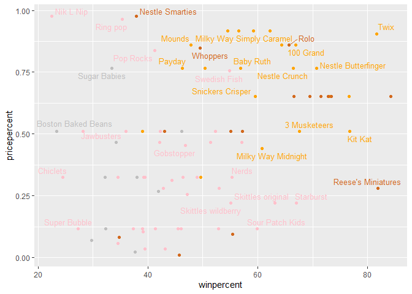
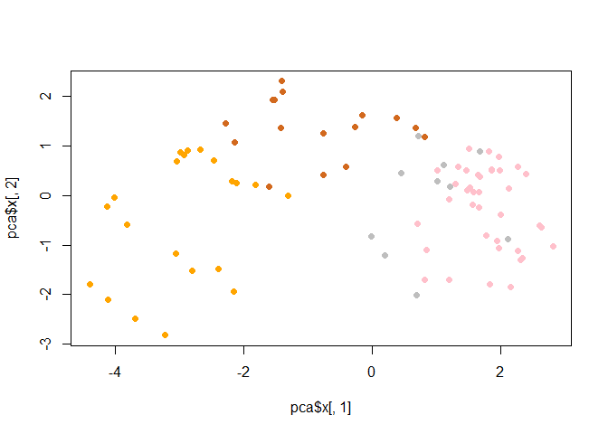
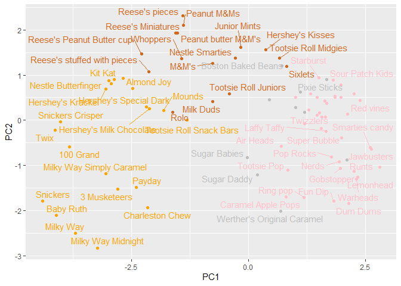
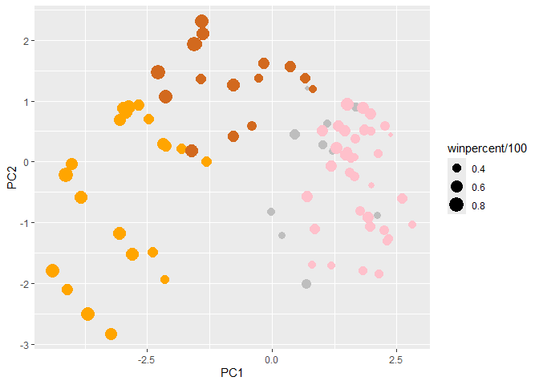
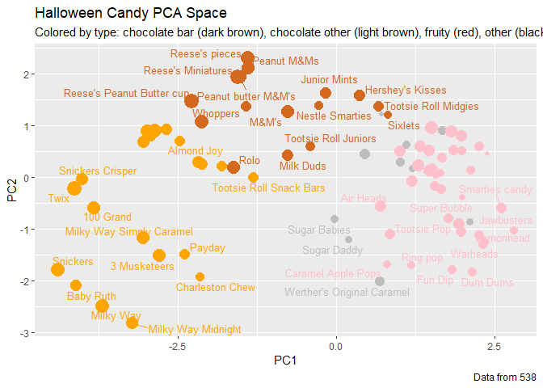
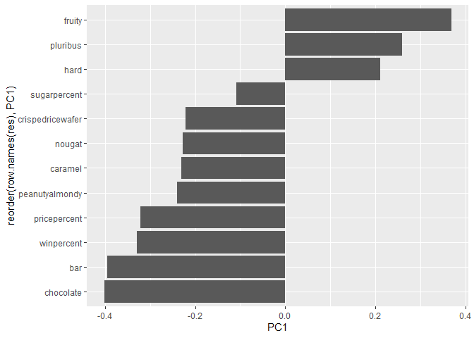

# Class 9: Candy Analysis Mini Project
Kevin Tan (PID: A16774162)

In today’s class we will examine some data about candy from 538

## Import Data

``` r
candy_file <- read.csv("candy-data.csv")

candy = data.frame(candy_file, row.names=1)
head(candy)
```

                 chocolate fruity caramel peanutyalmondy nougat crispedricewafer
    100 Grand            1      0       1              0      0                1
    3 Musketeers         1      0       0              0      1                0
    One dime             0      0       0              0      0                0
    One quarter          0      0       0              0      0                0
    Air Heads            0      1       0              0      0                0
    Almond Joy           1      0       0              1      0                0
                 hard bar pluribus sugarpercent pricepercent winpercent
    100 Grand       0   1        0        0.732        0.860   66.97173
    3 Musketeers    0   1        0        0.604        0.511   67.60294
    One dime        0   0        0        0.011        0.116   32.26109
    One quarter     0   0        0        0.011        0.511   46.11650
    Air Heads       0   0        0        0.906        0.511   52.34146
    Almond Joy      0   1        0        0.465        0.767   50.34755

## Data Exploration

> Q. How many different candy types are in the dataset?

There are 85 candy in this dataset

``` r
nrow(candy)
```

    [1] 85

> Q. How many fruity candy types are in the dataset?

There are 38 fruity candy types

``` r
sum(candy$"fruity")
```

    [1] 38

## My favorite candy vs yours

``` r
candy["Kit Kat",]$winpercent
```

    [1] 76.7686

``` r
candy["Warheads",]$winpercent
```

    [1] 39.0119

> Q3. What is your favorite candy in the dataset and what is it’s
> winpercent value?

My favorite candy is kitkat and it’s winpercent is 76.7686

> Q4. What is the winpercent value for “Kit Kat”?

The winpercent for kitkat is 76.7686

> Q5. What is the winpercent value for “Tootsie Roll Snack Bars”?

The winpercent for Tootsie Roll Snack Bars is 49.653503

``` r
library("skimr")
skim(candy)
```

|                                                  |       |
|:-------------------------------------------------|:------|
| Name                                             | candy |
| Number of rows                                   | 85    |
| Number of columns                                | 12    |
| \_\_\_\_\_\_\_\_\_\_\_\_\_\_\_\_\_\_\_\_\_\_\_   |       |
| Column type frequency:                           |       |
| numeric                                          | 12    |
| \_\_\_\_\_\_\_\_\_\_\_\_\_\_\_\_\_\_\_\_\_\_\_\_ |       |
| Group variables                                  | None  |

Data summary

**Variable type: numeric**

| skim_variable    | n_missing | complete_rate |  mean |    sd |    p0 |   p25 |   p50 |   p75 |  p100 | hist  |
|:-----------------|----------:|--------------:|------:|------:|------:|------:|------:|------:|------:|:------|
| chocolate        |         0 |             1 |  0.44 |  0.50 |  0.00 |  0.00 |  0.00 |  1.00 |  1.00 | ▇▁▁▁▆ |
| fruity           |         0 |             1 |  0.45 |  0.50 |  0.00 |  0.00 |  0.00 |  1.00 |  1.00 | ▇▁▁▁▆ |
| caramel          |         0 |             1 |  0.16 |  0.37 |  0.00 |  0.00 |  0.00 |  0.00 |  1.00 | ▇▁▁▁▂ |
| peanutyalmondy   |         0 |             1 |  0.16 |  0.37 |  0.00 |  0.00 |  0.00 |  0.00 |  1.00 | ▇▁▁▁▂ |
| nougat           |         0 |             1 |  0.08 |  0.28 |  0.00 |  0.00 |  0.00 |  0.00 |  1.00 | ▇▁▁▁▁ |
| crispedricewafer |         0 |             1 |  0.08 |  0.28 |  0.00 |  0.00 |  0.00 |  0.00 |  1.00 | ▇▁▁▁▁ |
| hard             |         0 |             1 |  0.18 |  0.38 |  0.00 |  0.00 |  0.00 |  0.00 |  1.00 | ▇▁▁▁▂ |
| bar              |         0 |             1 |  0.25 |  0.43 |  0.00 |  0.00 |  0.00 |  0.00 |  1.00 | ▇▁▁▁▂ |
| pluribus         |         0 |             1 |  0.52 |  0.50 |  0.00 |  0.00 |  1.00 |  1.00 |  1.00 | ▇▁▁▁▇ |
| sugarpercent     |         0 |             1 |  0.48 |  0.28 |  0.01 |  0.22 |  0.47 |  0.73 |  0.99 | ▇▇▇▇▆ |
| pricepercent     |         0 |             1 |  0.47 |  0.29 |  0.01 |  0.26 |  0.47 |  0.65 |  0.98 | ▇▇▇▇▆ |
| winpercent       |         0 |             1 | 50.32 | 14.71 | 22.45 | 39.14 | 47.83 | 59.86 | 84.18 | ▃▇▆▅▂ |

> Q6. Is there any variable/column that looks to be on a different scale
> to the majority of the other columns in the dataset?

Winpercent is on a different scale (from 1-100)

> Q7. What do you think a zero and one represent for the
> candy\$chocolate column?

They show whether the candy in a row is classified as chocolate

> Q8. Plot a histogram of winpercent values

``` r
library(ggplot2)
ggplot(candy) + 
  aes(x= winpercent) +
  geom_histogram(bins = 7)
```



> Q9. Is the distribution of winpercent values symmetrical?

The distribution is somewhat right skewed

> Q10. Is the center of the distribution above or below 50%?

the center (based on the mean) is slightly above 50%. The median is
below 50%

``` r
mean(candy$winpercent)
```

    [1] 50.31676

> Q11. On average is chocolate candy higher or lower ranked than fruit
> candy?

- first find all chocolate candy
- find their winpercent values
- calculate the mean of these values
- then do the same for fruity candy and compare with the mean for
  chocolate candy

``` r
choc_wr <- candy$winpercent[candy$chocolate==1]
mean(choc_wr)
```

    [1] 60.92153

``` r
fruit_wr <- candy$winpercent[candy$fruity==1]
mean(fruit_wr)
```

    [1] 44.11974

Chocolate candy is, on average, higher ranked than fruit candy

> Q12. Is this difference statistically significant?

``` r
t.test(choc_wr, fruit_wr)
```


        Welch Two Sample t-test

    data:  choc_wr and fruit_wr
    t = 6.2582, df = 68.882, p-value = 2.871e-08
    alternative hypothesis: true difference in means is not equal to 0
    95 percent confidence interval:
     11.44563 22.15795
    sample estimates:
    mean of x mean of y 
     60.92153  44.11974 

The difference is not statistically significant

> Q13. What are the five least liked candy types in this set?

``` r
head(candy[order(candy$winpercent),], 5)
```

                       chocolate fruity caramel peanutyalmondy nougat
    Nik L Nip                  0      1       0              0      0
    Boston Baked Beans         0      0       0              1      0
    Chiclets                   0      1       0              0      0
    Super Bubble               0      1       0              0      0
    Jawbusters                 0      1       0              0      0
                       crispedricewafer hard bar pluribus sugarpercent pricepercent
    Nik L Nip                         0    0   0        1        0.197        0.976
    Boston Baked Beans                0    0   0        1        0.313        0.511
    Chiclets                          0    0   0        1        0.046        0.325
    Super Bubble                      0    0   0        0        0.162        0.116
    Jawbusters                        0    1   0        1        0.093        0.511
                       winpercent
    Nik L Nip            22.44534
    Boston Baked Beans   23.41782
    Chiclets             24.52499
    Super Bubble         27.30386
    Jawbusters           28.12744

``` r
x <-  c(4,5,6)
order(x)
```

    [1] 1 2 3

The order function returns the sorted indices of the data, which can be
used to sort a dataframe. Defaults to ascending order

> Q14. What are the top 5 all time favorite candy types out of this set?

``` r
head(candy[order(candy$winpercent, decreasing=TRUE),], 5)
```

                              chocolate fruity caramel peanutyalmondy nougat
    Reese's Peanut Butter cup         1      0       0              1      0
    Reese's Miniatures                1      0       0              1      0
    Twix                              1      0       1              0      0
    Kit Kat                           1      0       0              0      0
    Snickers                          1      0       1              1      1
                              crispedricewafer hard bar pluribus sugarpercent
    Reese's Peanut Butter cup                0    0   0        0        0.720
    Reese's Miniatures                       0    0   0        0        0.034
    Twix                                     1    0   1        0        0.546
    Kit Kat                                  1    0   1        0        0.313
    Snickers                                 0    0   1        0        0.546
                              pricepercent winpercent
    Reese's Peanut Butter cup        0.651   84.18029
    Reese's Miniatures               0.279   81.86626
    Twix                             0.906   81.64291
    Kit Kat                          0.511   76.76860
    Snickers                         0.651   76.67378

> Q15. Make a first barplot of candy ranking based on winpercent values.

``` r
ggplot(candy) +
  aes(winpercent, rownames(candy)) +
  geom_col()
```


> Q16. This is quite ugly, use the reorder() function to get the bars
> sorted by winpercent?

``` r
ggplot(candy) +
  aes(winpercent, reorder(rownames(candy),winpercent)) +
  geom_col()
```



``` r
ggsave("mybarplot.png", height = 10)
```

    Saving 7 x 10 in image


Add my custom colors to my barplot

``` r
my_cols=rep("gray", nrow(candy))
my_cols[as.logical(candy$chocolate)] = "chocolate"
my_cols[as.logical(candy$bar)] = "orange"
my_cols[as.logical(candy$fruity)] = "pink"

ggplot(candy) + 
  aes(winpercent, reorder(rownames(candy),winpercent)) +
  geom_col(fill=my_cols) 
```



> Q17. What is the worst ranked chocolate candy?

Sixlets \> Q18. What is the best ranked fruity candy?

Starbursts

Plot of winpercent vs pricepercent

``` r
ggplot(candy) +
  aes(winpercent, pricepercent, label=rownames(candy)) +
  geom_point(col=my_cols) + 
  geom_label(col=my_cols)
```



There are just too many labels in this above plto to be readalbe. We can
use `ggrepel` package to od a beter job of placing labels so they
minimize text overlap

``` r
library(ggrepel)

ggplot(candy) +
  aes(winpercent, pricepercent, label=rownames(candy)) +
  geom_point(col=my_cols) + 
  geom_text_repel(col=my_cols, size=3.3, max.overlaps = 5)
```

    Warning: ggrepel: 54 unlabeled data points (too many overlaps). Consider
    increasing max.overlaps



> Q19. Which candy type is the highest ranked in terms of winpercent for
> the least money - i.e. offers the most bang for your buck?

Reese’s Miniatures

> Q20. What are the top 5 most expensive candy types in the dataset and
> of these which is the least popular?

``` r
ord <- order(candy$pricepercent, decreasing = TRUE)
head( candy[ord,c(11,12)], n=5 )
```

                             pricepercent winpercent
    Nik L Nip                       0.976   22.44534
    Nestle Smarties                 0.976   37.88719
    Ring pop                        0.965   35.29076
    Hershey's Krackel               0.918   62.28448
    Hershey's Milk Chocolate        0.918   56.49050

Nik L Nip is the most expensive and least popular

## Correlations

``` r
library(corrplot)
```

    corrplot 0.92 loaded

``` r
cij <- cor(candy)
cij
```

                      chocolate      fruity     caramel peanutyalmondy      nougat
    chocolate         1.0000000 -0.74172106  0.24987535     0.37782357  0.25489183
    fruity           -0.7417211  1.00000000 -0.33548538    -0.39928014 -0.26936712
    caramel           0.2498753 -0.33548538  1.00000000     0.05935614  0.32849280
    peanutyalmondy    0.3778236 -0.39928014  0.05935614     1.00000000  0.21311310
    nougat            0.2548918 -0.26936712  0.32849280     0.21311310  1.00000000
    crispedricewafer  0.3412098 -0.26936712  0.21311310    -0.01764631 -0.08974359
    hard             -0.3441769  0.39067750 -0.12235513    -0.20555661 -0.13867505
    bar               0.5974211 -0.51506558  0.33396002     0.26041960  0.52297636
    pluribus         -0.3396752  0.29972522 -0.26958501    -0.20610932 -0.31033884
    sugarpercent      0.1041691 -0.03439296  0.22193335     0.08788927  0.12308135
    pricepercent      0.5046754 -0.43096853  0.25432709     0.30915323  0.15319643
    winpercent        0.6365167 -0.38093814  0.21341630     0.40619220  0.19937530
                     crispedricewafer        hard         bar    pluribus
    chocolate              0.34120978 -0.34417691  0.59742114 -0.33967519
    fruity                -0.26936712  0.39067750 -0.51506558  0.29972522
    caramel                0.21311310 -0.12235513  0.33396002 -0.26958501
    peanutyalmondy        -0.01764631 -0.20555661  0.26041960 -0.20610932
    nougat                -0.08974359 -0.13867505  0.52297636 -0.31033884
    crispedricewafer       1.00000000 -0.13867505  0.42375093 -0.22469338
    hard                  -0.13867505  1.00000000 -0.26516504  0.01453172
    bar                    0.42375093 -0.26516504  1.00000000 -0.59340892
    pluribus              -0.22469338  0.01453172 -0.59340892  1.00000000
    sugarpercent           0.06994969  0.09180975  0.09998516  0.04552282
    pricepercent           0.32826539 -0.24436534  0.51840654 -0.22079363
    winpercent             0.32467965 -0.31038158  0.42992933 -0.24744787
                     sugarpercent pricepercent winpercent
    chocolate          0.10416906    0.5046754  0.6365167
    fruity            -0.03439296   -0.4309685 -0.3809381
    caramel            0.22193335    0.2543271  0.2134163
    peanutyalmondy     0.08788927    0.3091532  0.4061922
    nougat             0.12308135    0.1531964  0.1993753
    crispedricewafer   0.06994969    0.3282654  0.3246797
    hard               0.09180975   -0.2443653 -0.3103816
    bar                0.09998516    0.5184065  0.4299293
    pluribus           0.04552282   -0.2207936 -0.2474479
    sugarpercent       1.00000000    0.3297064  0.2291507
    pricepercent       0.32970639    1.0000000  0.3453254
    winpercent         0.22915066    0.3453254  1.0000000

``` r
corrplot(cij)
```


> Q22. Examining this plot what two variables are anti-correlated
> (i.e. have minus values)?

Chocolate and fruity

> Q23. Similarly, what two variables are most positively correlated?

chocolate and bar

## 6. Principal Component Analysis

We will perform a PCA of the candy. Key-question: do we need to scale
the data before PCA?

``` r
pca <- prcomp(candy, scale=TRUE)
summary(pca)
```

    Importance of components:
                              PC1    PC2    PC3     PC4    PC5     PC6     PC7
    Standard deviation     2.0788 1.1378 1.1092 1.07533 0.9518 0.81923 0.81530
    Proportion of Variance 0.3601 0.1079 0.1025 0.09636 0.0755 0.05593 0.05539
    Cumulative Proportion  0.3601 0.4680 0.5705 0.66688 0.7424 0.79830 0.85369
                               PC8     PC9    PC10    PC11    PC12
    Standard deviation     0.74530 0.67824 0.62349 0.43974 0.39760
    Proportion of Variance 0.04629 0.03833 0.03239 0.01611 0.01317
    Cumulative Proportion  0.89998 0.93832 0.97071 0.98683 1.00000

``` r
plot(pca$x[,1], pca$x[,2], col=my_cols, pch=16)
```



Make a ggplot version of this figure:

``` r
# Make a new data-frame with our PCA results and candy data
my_data <- cbind(candy, pca$x[,1:3])
p <- ggplot(my_data) + 
        aes(x=PC1, y=PC2, 
            text=rownames(my_data),
            label=rownames(my_data)) +
        geom_point(col=my_cols) + 
        geom_text_repel(col=my_cols)

p
```

    Warning: ggrepel: 25 unlabeled data points (too many overlaps). Consider
    increasing max.overlaps



make this a bit nicer

``` r
p <- ggplot(my_data) + 
        aes(x=PC1, y=PC2, 
            size=winpercent/100,  
            text=rownames(my_data),
            label=rownames(my_data)) +
        geom_point(col=my_cols)

p
```



``` r
p + geom_text_repel(size=3.3, col=my_cols, max.overlaps = 7)  + 
  theme(legend.position = "none") +
  labs(title="Halloween Candy PCA Space",
       subtitle="Colored by type: chocolate bar (dark brown), chocolate other (light brown), fruity (red), other (black)",
       caption="Data from 538")
```

    Warning: ggrepel: 43 unlabeled data points (too many overlaps). Consider
    increasing max.overlaps



``` r
library(plotly)

ggplotly(p)
```

How do the original varibables contribute to our PCs? For this, we look
at the loadings component of our results objecct i.e. the `pca$rotation`

``` r
head(pca$rotation, 5)
```

                          PC1        PC2         PC3          PC4         PC5
    chocolate      -0.4019466  0.2140416  0.01601358 -0.016673032  0.06603585
    fruity          0.3683883 -0.1830467 -0.13765612 -0.004479829  0.14353533
    caramel        -0.2299709 -0.4034989 -0.13294166 -0.024889542 -0.50730150
    peanutyalmondy -0.2407155  0.2244692  0.18272802  0.466784287  0.39993025
    nougat         -0.2268102 -0.4701660  0.33970244  0.299581403 -0.18885242
                           PC6         PC7        PC8          PC9        PC10
    chocolate      -0.09018950 -0.08360642 -0.4908486 -0.151651568  0.10766136
    fruity         -0.04266105  0.46147889  0.3980580 -0.001248306  0.36206250
    caramel        -0.40346502 -0.44274741  0.2696345  0.019186442  0.22979901
    peanutyalmondy -0.09416259 -0.25710489  0.4577145  0.381068550 -0.14591236
    nougat          0.09012643  0.36663902 -0.1879396  0.385278987  0.01132345
                         PC11       PC12
    chocolate       0.1004528 0.69784924
    fruity          0.1749490 0.50624242
    caramel         0.1351582 0.07548984
    peanutyalmondy  0.1124428 0.12972756
    nougat         -0.3895447 0.09223698

Make a barplot with ggplot and order the bars by their value.

``` r
res <- as.data.frame(pca$rotation)

ggplot(res) + 
  aes(PC1, reorder(row.names(res), PC1)) + 
  geom_col()
```



> Q24. What original variables are picked up strongly by PC1 in the
> positive direction? Do these make sense to you?

Fruity, hard, and pluribus are picked up strongly in the positive
direction. This makes sense, since fruity candy generally also have the
traits of being hard and packaged in a mixed bag.
